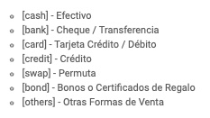
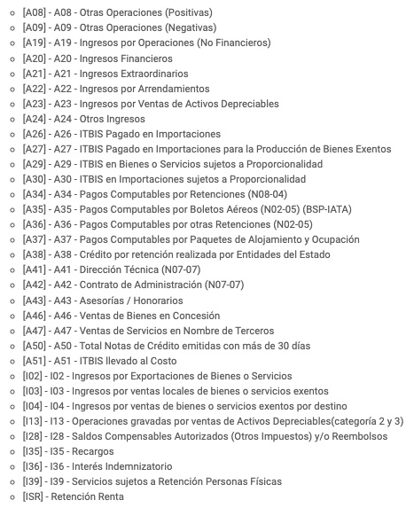
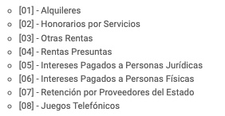
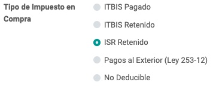

# Introducción
Este módulo genera los reportes de la DGII (606, 607, 608 y 609)

Se utiliza en conjunto con **l10n_do_ncf_sequence**

# Uso del Módulo

## Clientes / Proveedores
Los que son Extranjeros, debemos completar el campo Related/Not Related, dado que se valor se usa en el reporte 607 de pagos al Extranjero.

## Diarios
En los Diarios de Tipo **Efectivo y Banco**, es necesario configurar la **Forma de Pago**, dado que dicha información se utiliza en las sumarizaciones del reporte **607**. Los posibles valores son:

## Cuentas

En las Cuentas se deben configurar, donde aplique, los siguientes valores:

1. **Tipo de Cuenta Fiscal** (account_fiscal_type), con alguno de los siguientes valores:

    

2. Si el **Tipo de Cuenta Fiscal es ISR** - Retención Renta, entonces se puede configurar el campo **ISR Witholding Type** (isr_retention_type), con alguno de los siguientes valores:

    

## Impuestos

En los Impuestos se debe configurar, donde aplique, los siguientes valores:

1. Si es un impuesto de Tipo **Compra**, el campo **Tipo de Impuesto de Compra** (purchase_tax_type) debe tomar alguno de los siguientes valores:

    

2. Si es un Impuesto de **Compra**, de Tipo *ISR Retenido*, el campo **Tipo de Retención en ISR** (isr_retention_type) debe tomar alguno de los siguientes valores:

    

## Facturas

En la Factura hay campos que sumarizan/escriben informaciones, para luego ser utilizados en los reportes:

Campo | Nombre Técnico | Descripción
---------|----------|---------
Monto Impuesto Selectivo al Consumo | selective_tax | Suma los montos de los impuestos cuyo **Grupo** es **ISC**
Monto Otros Impuestos/Tasas | other_taxes | Suma los montos de los impuestos cuyo **Grupo** es **Otros Impuestos**
Monto Propina Legal | legal_tip | Suma los montos de los impuestos cuyo **Grupo** es **Propina**
ITBIS sujeto a proporcionalidad | proportionality_tax | Suma los montos de los impuestos cuya **Cuenta** asociada es de **Tipo Fiscal A29 o A30**
ITBIS llevado al Costo | cost_itbis | Suma los montos de los impuestos cuya **Cuenta** asociada es de **Tipo Fiscal A51**
Monto calculado en bienes | good_total_amount | Suma los subtotales (antes de impuestos) de los renglones cuyo Tipo de Producto es **Almacenable** o **Consumible**.
Monto calculado en servicio | service_total_amount | Suma los subtotales (antes de impuestos) de los renglones que **no tienen un Producto**, o bien que el Tipo de Producto es **Servicio**.
Tipo de Retención ISR | isr_withholding_type | Campo de texto de 2 caracteres, que guarda el número de ISR Retenido, en base al **Tipo de Retención de ISR del Impuesto asociado al renglón**, o al **Tipo de Retención de ISR de la cuenta asociada al Apunte Contable del renglón**.
Forma de Pago | payment_form | Campo de texto de 2 caracteres, donde se escribe la forma de pago, en base a los Tipos de Diarios a los cuales se asociaron los pagos. Si no tiene pagos, se busca un Movimiento Contable asociado a esta factura, y se toma como una Permuta. Si no sucede nada de lo anterior, pero la factura está saldada, se asume que es una Nota de Crédito. _**Posibles valores:**_ (01) cash -- Efectivo // (02) bank -- Cheques / Transferencias / Depósitos // (03) card -- Tarjeta Crédito / Débito // (04) credit -- Compra a Crédito // (05) swap -- Permuta // (06) credit_note -- Notas de Crédito // (07) mixed -- Mixto (se usa este valor cuando la factura recibió varios pagos, con diferentes medios de pago entre ellos).
ITBIS Facturado | invoiced_itbis | Suma los montos de los impuestos cuyo Grupo es **ITBIS o ITBIS 18%**, sin considerar aquellos impuestos que pueden pertenecer a los anteriores grupos, pero que el Tipo de Impuesto de Compra es **ITBIS Retenido**.
Monto ITBIS a Retener | withholded_itbis | Para facturas de Compra, suma de los montos de impuestos cuyo Tipo de Impuesto de Compra es **ITBIS Retenido**.
Monto ISR a Retener | income_withholding | Para facturas de Compras, suma de los montos de impuestos cuyo Tipo de Impuesto de Compra es **ISR Retenido**.
Monto ITBIS Retenido | withheld_itbis (cálculo inicial) // Si es **Factura de Venta**: third_withheld_itbis = withheld_itbis // Si es **Factura de Compra**: withholded_itbis = withheld_itbis | Para facturas de Compras y Ventas, suma los montos de impuestos de los Apuntes Contables de los pagos de la factura, cuyo Diario esté asociado a una Cuenta de **Tipo Fiscal A34 o A36**. **Este Diario no debe tener configurado Forma de Pago**.
Monto ISR Retenido | withheld_isr (cálculo inicial) // Si es una **Factura de Venta**: third_income_withholding = withheld_isr // Si es una **Factura de Compra**: income_withholding = withheld_isr | Para facturas de Compras y Ventas, suma los montos de impuestos de los Apuntes Contables de los pagos de la factura, cuyo Diario esté asociado a una Cuenta de **Tipo Fiscal ISR o A38**. **Este Diario no debe tener configurado Forma de Pago**.
ITBIS por Adelantar | advance_itbis | invoiced_itbis - cost_itbis
Es Exterior | is_exterior| Campo Booleano que se establece en base a si el Tipo de NCF del Comprobante asociado a la Factura es **Exterior (17)**
Detalle del Tipo de Servicio | service_type_detail | Este campo se debe completar en base a el código del **Tipo de Costos y Gastos** asociado a la Factura, y solo se presenta si es una compra al Exterior (solo se usa en el reporte **609**).
Fecha del Pago | payment_date | Campo de fecha que almacena la fecha de pago de la factura, en base a la fecha del último Pago asociado a la misma. Solo se calcula si se genera la Retención ITBIS o Retención ISR (al pasar la Factura a Pagada), caso contrario queda en blanco.
Estatus Fiscal | fiscal_status | El estado **Gris** significa que la factura no ha sido reportado completamente, y podría aparecer en otro reporte si hubo retenciones. El estado **Verde** significa que la factura se ha reportado completamente. El estado **Rojo** significa que la factura está incluida en un reporte que aún no se ha enviado a la DGII. El estado **Vacío** significa que la factura no se ha incluído en un reporte.

## Reportes DGII
### 606
Este reporte considera **Facturas de Compras, Notas de Crédito de Proveedores y Notas de Débito de Proveedores**, cuyo estado sea **Abierta, En Proceso de Pago, y Pagadas**.

### 607
Este reporte considera **Facturas de Venta, Notas de Crédito y Notas de Débito**, cuyo estado sea **Abierta, En Proceso de Pago, y Pagadas**.

Contabiliza las **Facturas de Consumo (B02)** con monto menor a RD$ 250,000.00, aunque a éstas **no las incluye en el archivo TXT**.
### 608
Este reporte considera **Facturas de Compras, Ventas o Notas de Crédito**, cuyo estado sea **Cancelada**.

Si son Facturas de Compras, no contabiliza las que sean **Fiscales (B01)** (que son las que recibimos de un Proveedor Inscripto), sino que se enfoca en las Facturas de Compras para las cuales nosotros le generamos el NCF.

### 609
Este reporte considera **Facturas de Compras o Notas de Débito**, cuyo estado sea **Abierta, En Proceso de Pago, y Pagadas**, solamente de proveedores **Extranjeros**.

## Vistas

### Facturas
El estado de Pago de cada factura se encuentra en el campo **Payment_State**. El mismo se puede agregar a las vistas de Árbol de facturas, para saber el estado de pago de cada factura.

> En versiones anteriores, el estado de pago se encontraba en el mismo estado de la Factura.

# TO-DO
- Sacar de este módulo los campos que se crean en Impuestos, Cuentas y Diarios, y meter eso en l10n_do_accounting.
- El Fiscal Status no se setea bien en facturas de Proveedores Canceladas.
- Traducciones pendientes:
  - FACTURA
    - FISCAL STATUS
    - FORMA DE PAGO muestra Credit, etc.
    - Service Type Detail
  - REPORTE
    - Estado del reporte (SENT, etc.)
    - State está traducido como “Provincia” en el tree de Reportes DGII
  - Res_Partner
    - Not_Related / Related